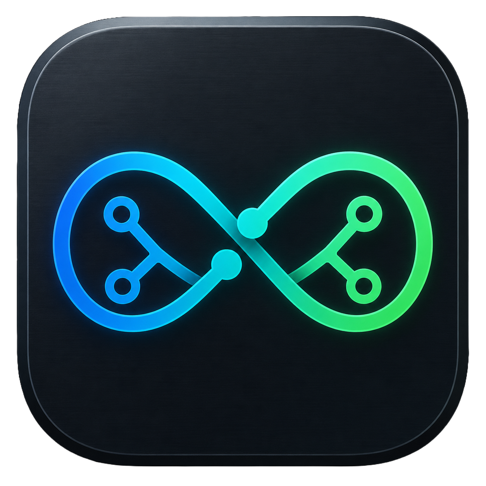

<p align="center">
  
</p>

# OmniSync

[](https://github.com/nipunyatawara-dev/Omnisync)
[-lightgrey)](https://github.com/nipunyatawara-dev/Omnisync)
[](https://github.com/nipunyatawara-dev/Omnisync)

---

### Get started

* [Latest release](https://github.com/nipunyatawara-dev/Omnisync/releases/latest)
* [Clone & run from source](#development)

---

**OmniSync** is a desktop workspace launcher and sync dashboard for local and GitHub-backed repositories — built with Electron and Next.js.

* Multi-workspace profiles with one-click switching
* Clone from GitHub or register an existing local folder
* Integrated file tree, tabbed editor, and Markdown preview
* Git branch switcher for local and remote branches, with ahead/behind sync status
* Collaboration feed that tags commits with every branch that contains them
* Three-pane merge conflict resolver
* Environment diagnostics (Node engines, dependencies, releases/deployments, git health)
* Setup prompt to detect and install Node.js, Git, and GitHub CLI when missing
* Built-in dev server runner with live stdout/stderr
* Launch targets: browser, Electron shell, Xcode, and popular IDEs
* Encrypted credential storage via the OS keychain

# Contents

- [What OmniSync is and isn't](#what-omnisync-is-and-isnt)
- [Setup wizard](#setup-wizard)
- [Workspace](#workspace)
- [Git sync & conflicts](#git-sync--conflicts)
- [Diagnostics](#diagnostics)
- [Settings](#settings)
- [Dev runner](#dev-runner)
- [Development](#development)
- [Architecture](#architecture)
- [Contributing](#contributing)

# What OmniSync is and isn't

* **OmniSync is** a workspace hub that connects your local repositories, Git remotes, and development tooling into one desktop dashboard.

* **OmniSync is not** a full IDE or a replacement for Git on the command line. It orchestrates your workspace — it doesn't replace your editor of choice. Use it alongside Cursor, VS Code, Xcode, or IntelliJ.

# Setup wizard

On first launch, OmniSync walks you through a short setup flow at `/setup`:

1. **Account login** — Connect via GitHub OAuth or a personal access token. Skipped automatically if profiles already exist on this machine.
2. **Workspace select** — Pick from configured local workspaces or add a new one with the **+** card.
3. **Setup mode** — Choose one of two paths:
   - **GitHub** — Clone a remote repository to a local path.
   - **Local** — Point OmniSync at an existing folder on disk.

Both paths create a profile, set it as the active session, and redirect to the dashboard.

If Node.js, Git, or the GitHub CLI is missing, a bottom-right setup prompt appears on the select-workspace screen. You can expand a checklist, install tools from the app (Homebrew when available, otherwise a local copy), or dismiss the prompt.

# Workspace

The main dashboard (`/`) is organized around a sidebar with five views:

| Tab | What it does |
| --- | --- |
| **Workspace** | File tree, resizable editor panes, git history column, and line diff viewer |
| **Git Sync** | Local/remote branches, collaboration feed, upstream status, and the conflict resolver |
| **Diagnostics** | Environment audits, dependency inventory, releases/deployments, and repair commands |
| **Timeline** | Repository commit calendar and history |
| **Settings** | Per-workspace Git identity/sync, workspace paths, run scripts, and (from setup) global defaults |

**Workspace view** highlights:

* Browse and open files from a live-scanned project tree
* File viewer with Markdown rendering for `.md` files
* Resizable panels — drag dividers to fit your layout
* Commit timeline and per-file diff analysis in the right column

# Git sync & conflicts

OmniSync keeps you oriented relative to your remote:

* Lists **local and remote** branches after clone (remote-only branches can be checked out as tracking branches)
* Collaboration feed tags each commit with every branch that contains it
* Shows commits **ahead** and **behind** upstream
* Scans for merge conflict markers (`<<<<<<<`)

When conflicts are found, the **Git Sync** tab opens an interactive three-pane resolver:

* **Current** (yours) on the left
* **Incoming** (theirs) on the right
* **Result** in the center — accept blocks individually to build the resolved file

# Diagnostics

The diagnostics scanner verifies your workspace is ready to run:

* Node.js version vs. `engines.node` in `package.json`
* Dependencies check — click the tile to see installed and missing package names
* Git repository health
* Project metadata (name, version, license, description from `package.json`, GitHub, or README)
* GitHub **Releases** and **Deployments** when the linked repo has them

Warnings surface actionable fixes — including triggers to install missing packages.

# Settings

Settings behave differently depending on where you open them:

* **Inside an open workspace** — **Settings → Git** shows that workspace’s git identity, auto-fetch, and branch protection.
* **Select-workspace / setup Settings** — **Settings → Git** shows the **global** default git identity and sync defaults for every workspace.
* **Settings → Workspaces** — Manage each workspace’s path, run scripts, and danger-zone delete. Deleting a non-active workspace stays in Settings; deleting the active one returns to workspace selection.

# Dev runner

Start, stop, and monitor development servers from the dashboard:

* Live **stdout** / **stderr** in the runner console
* Configurable `runCommand` and `buildCommand` per workspace
* Launch the running app in a browser, Electron wrapper, or native IDE once the server is up

# Development

### Prerequisites

* Node.js 20+
* npm

### Run locally

Prefer launching through Electron so the API cookie and encryption secret are provisioned:

```bash
git clone https://github.com/nipunyatawara-dev/Omnisync.git
cd Omnisync
npm install
npm run electron   # starts Electron + Next.js with a secure local API token
```

For UI-only work you can run Next alone, but that mode does not auto-set the API cookie and is **not** a supported secure deployment:

```bash
npm run dev        # Next.js only — see SECURITY.md
```

Optional OAuth overrides: copy [`.env.example`](.env.example) to `.env.local`.

### Build

```bash
npm run build
npm start
```

Profile data, encrypted secrets, and workspace configuration are stored under `User data/` in the project root (mode `0600` for credential files).

### Package for distribution

```bash
npm run build
npm run electron:pack    # unpacked app in dist/
npm run electron:build   # platform installers (.dmg, .exe, .AppImage)
```

macOS builds ship **unsigned** by default (`identity: null`). Distributing signed/notarized builds requires an Apple Developer identity configured in electron-builder. Unsigned apps may need right-click → Open on first launch.

### Tests

```bash
npm test
```

See also [SECURITY.md](SECURITY.md) for the local-trust threat model.
# Architecture

OmniSync is a three-layer desktop app:

```
Electron shell (main.js)
    └── spawns Next.js on localhost:47821
            └── React dashboard (src/app/)
                    └── API routes (src/app/api/)
                            └── lib helpers (src/lib/)
                                    └── filesystem + git + child processes
```

| Layer | Key files | Responsibility |
| --- | --- | --- |
| **Shell** | `main.js`, `preload.js` | Window, API token cookie, encryption secret, directory picker IPC |
| **UI** | `src/app/page.tsx`, `src/components/views/` | Dashboard tabs: workspace, git sync, diagnostics, timeline, settings |
| **API** | `src/app/api/workspace/*`, `src/middleware.ts` | Auth-guarded routes for git, files, runner, launch, diagnostics |
| **Core** | `src/lib/git.ts`, `profiles.ts`, `pathSafety.ts`, `platformLaunch.ts` | Git ops, encrypted profiles, safe paths, cross-platform IDE launch |

**Security model:** Electron generates a per-session API token and encryption secret. Middleware requires a matching HttpOnly cookie on all `/api/*` routes from localhost only. GitHub tokens are persisted server-side only (AES-256-GCM with a per-install salt) and are not returned to the browser after OAuth/device auth.

**Data flow (git sync):** UI → `POST /api/workspace/git` → `src/lib/git.ts` → system `git` binary → JSON response → dashboard state via `useGitSync` hook.

# Platform support

OmniSync is **macOS-first**: IDE launch, folder permissions, and dock integration are optimized for macOS. Windows and Linux builds are supported via electron-builder, and `src/lib/platformLaunch.ts` includes cross-platform paths, but those targets receive less testing. Unsigned macOS builds may require right-click → Open on first launch; see Development → Package for distribution.

# Contributing

Pull requests are welcome.

1. Fork the repository
2. Create a feature branch (`git checkout -b feat/my-feature`)
3. Commit your changes
4. Push and open a pull request

Please keep changes focused and match the existing code style.

---


> **Cursor Composer 2.5 Flash** and **Gemini 3.5 Flash** models were used for development support. 
> 
> This is a **Beta software** . Feedback and bug reports are welcome via [GitHub Issues](https://github.com/nipunyatawara-dev/Omnisync/issues).
